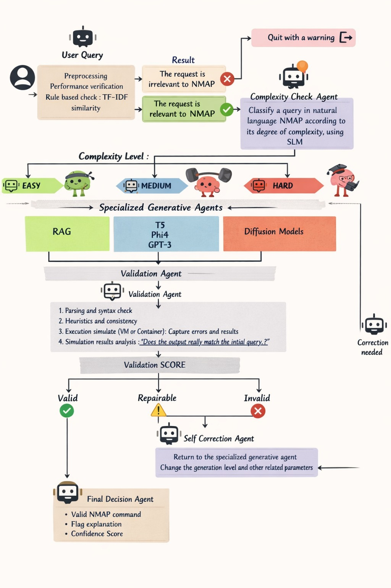
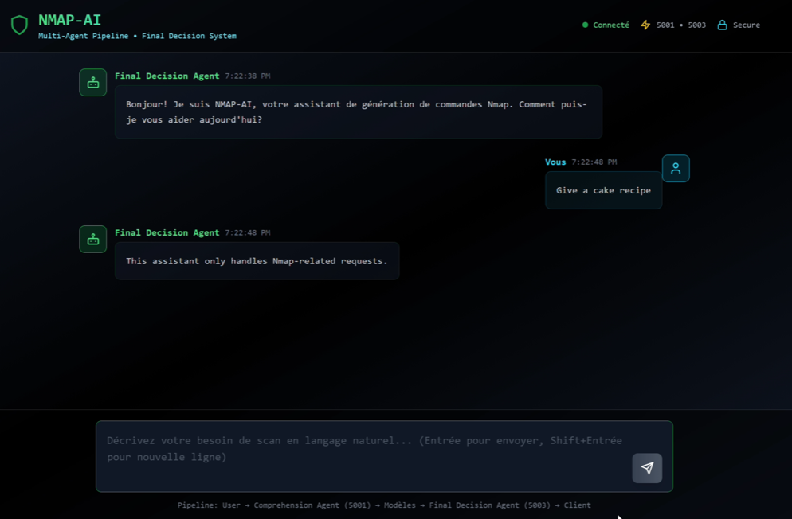
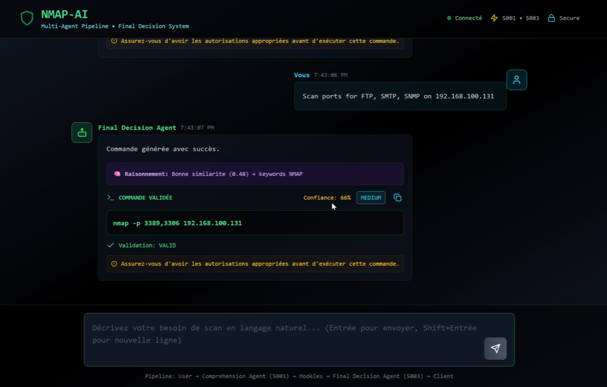
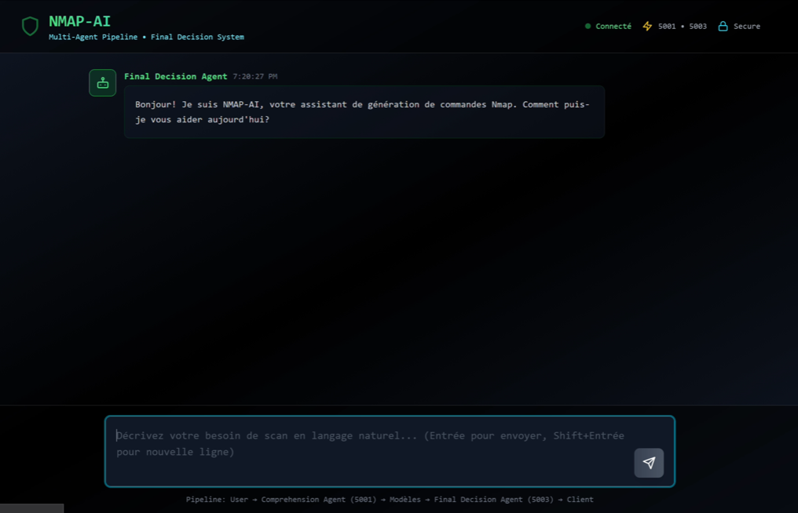

# NMAP_AI - Rapport technique

## 1) Resume
Ce projet genere des commandes Nmap a partir d'une requete en langage naturel.
Le pipeline combine comprehension, classification de complexite, generation et validation.

## 2) Schema global
Le pipeline principal suit la chaine suivante:
1) Comprehension Agent
2) Complexity Agent
3) Generation (Easy / Medium / Hard)
4) Validation (Kali API)
5) Retry / Escalation

## 3) Agents et fonctionnement

### 3.1 Comprehension Agent (spaCy embeddings)
Fichier: `backend/Agents/Agent_comprehension/nmap_agent_embeddings.py`

Role:
- Filtrer les requetes hors contexte (non Nmap)

Fonctionnement:
- Charge spaCy `en_core_web_sm`
- Calcule un embedding du domaine Nmap a partir de `nmap_domain.txt`
- Mesure la similarite cosinus entre requete et domaine
- Detecte des mots hors contexte (pdf, video, music, etc.)

Sorties:
- `is_relevant`, `confidence`, `keywords`, `reason`

### 3.2 Complexity Agent (SLM + Word2Vec)
Fichier: `backend/Agents/Agent_complexity/complexity_slm_word2vec.py`

Role:
- Classer la requete en `easy`, `medium`, `hard`

Fonctionnement:
- Unigram language model (SLM) + Word2Vec
- Combine les scores (50% SLM, 50% W2V)
- Retourne la classe avec la meilleure proba

Sorties:
- `level`, `confidence`, `probabilities`, `recommended_model`

### 3.3 Easy Agent (RAG + Neo4j)
Fichier: `backend/Agents/Agent_easy/rag_engine.py`

Role:
- Generer des commandes fiables pour les cas simples

Fonctionnement:
- Knowledge Graph Neo4j: Scans, Options, Categories, Examples, Validation
- IntentClassifier: detecte l'intention (host discovery, port scan, vuln, etc.)
- Extraction de cible (IP/hostname) et ports
- CommandGenerator: choisit un scan et options compatibles
- CommandValidator: verifie conflits et prerequisites

Avantages:
- Explicable
- Robuste sur requetes simples

### 3.4 Medium Agent (T5 + LoRA)
Fichier: `backend/APIs/api_medium.py`

Role:
- Generer du texte plus flexible tout en respectant la syntaxe

Fonctionnement:
- T5 finetune via LoRA (PEFT)
- Generation autoregressive token par token
- Regles correctives (ex: ping scan -> -sn)
- Execution CPU only (stable)

### 3.5 Hard Agent (Diffusion token-level)
Fichiers:
- `backend/Agents/Agent_hard/train_model.py`
- `backend/Agents/Agent_hard/token_level_tokenizer.py`
- `backend/Agents/Agent_hard/quick_test.py`

Role:
- Explorer la diffusion en espace d'embeddings pour generer des commandes

Tokenisation:
- Flags: `-sS`, `-sU`, `--script`, `-p`
- Placeholders: `<IP>`, `<PORT_RANGE>`, `<TARGET>`
- Unknowns types: `<UNK_FLAG>`, `<UNK_ARG>`, `<UNK_TARGET>`

Modele:
- Transformer encoder/decoder
- d_model=384, 6 couches, 8 heads
- Diffusion schedule 200 timesteps (betas lineaires)

Loss:
- MSE sur embeddings
- CrossEntropy sur tokens
- Loss totale = MSE + 0.5 * CE

Generation:
- Bruit initial -> denoising iteratif
- Projection vers vocab via similarite d'embeddings
- Top-k sampling
- Post-traitement: dedup + commande minimale (nmap + un seul -p)

Etat:
- Non integre dans `backend/api.py`
- `backend/Agents/Agent_hard/__init__.py` reference `agent_diffusion.py` (fichier absent)

## 4) Pourquoi la diffusion ne fonctionne pas (et ne marchera pas ici)

Probleme structurel:
- La diffusion gaussienne suppose un espace continu et lisse.
- Le texte Nmap est discret, symbolique et fortement contraint.

Effets observes:
- Tokens incoherents (flags incompatibles, options hors contexte)
- Repetitions
- Fragments inutiles (ex: "open", "Ports:")

Raison profonde:
- Le modele optimise une distance dans l'espace embedding, pas la validite syntaxique.
- La generation est non-autoregressive: pas de dependances explicites entre tokens.
- Le post-traitement corrige la forme mais pas la structure globale.

Conclusion:
Dans ce cadre (diffusion gaussienne sur embeddings + generation non autoregressive),
le modele ne peut pas produire des commandes Nmap fiables. Meme avec plus de donnees,
il restera instable car la representation continue n'encode pas la grammaire discretes.

## 5) Validation
Fichier: `backend/api.py`

- Validation via une API sur VM Kali
- Verdicts: VALID / INVALID / REPAIRABLE / UNSAFE
- Retry automatique jusqu'a 5 tentatives

## 6) Interface
Dossier: `Interface/`

- UI pour entrer une requete
- Affiche commande generee et validation

## 7) Technologies utilisees (hors diffusion)
- FastAPI (API unifiee)
- spaCy embeddings (comprehension)
- Word2Vec (complexity)
- Neo4j (RAG)
- Transformers + PEFT LoRA (T5)
- Validation API externe (Kali)
